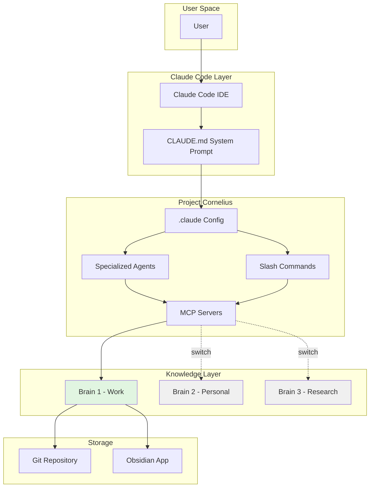
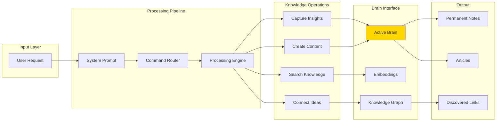
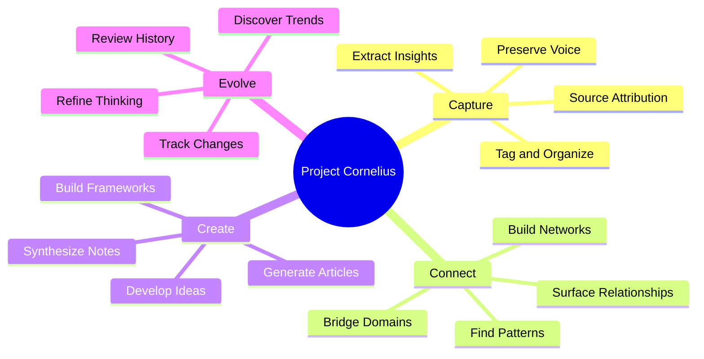

# Project Cornelius

**AI-powered second brain template for Claude Code + Obsidian**

Capture insights, discover connections, and synthesize knowledge—with AI assistance.

## 📌 TL;DR

**Project Cornelius** = Claude Code + Custom Agents + Obsidian + Switchable Knowledge Bases

It's like having a highly specialized AI research assistant that:
- 🧠 **Manages multiple "brains"** (knowledge vaults) you can switch between
- 🔍 **Finds hidden connections** in your notes you didn't know existed
- ✍️ **Writes articles** from your accumulated insights
- 🎯 **Captures unique thoughts** while preserving your voice
- 🔄 **Evolves with you** through Git-tracked configurations

**One command to switch contexts:**
```bash
/switch-brain /path/to/work-vault    # Work mode
/switch-brain /path/to/personal-vault # Personal mode
/switch-brain /path/to/research-vault # Research mode
```

---

## 🧠 What is Project Cornelius?

Project Cornelius is a **multi-layered knowledge management system** that creates an intelligent bridge between your thinking and AI assistance. It's an agent-within-an-agent architecture that transforms Claude Code into a specialized second brain operator.

### Three Perspectives

#### 1️⃣ **Topological View** - Component Architecture



#### 2️⃣ **Architectural View** - Data Flow & Processing



#### 3️⃣ **Cognitive View** - Mind Management Perspective



### How It Works

1. **You** interact with Claude Code normally
2. **CLAUDE.md** configures Claude as a specialized knowledge assistant
3. **Agents** perform specific knowledge tasks autonomously
4. **Commands** provide quick access to common operations
5. **MCP Servers** bridge to your Obsidian vault(s)
6. **Brains** (vaults) can be switched with a single command
7. **Git** tracks your agent configurations (not your private notes)

### Key Innovation: Switchable Brains 🔄

```bash
# Working on a project
/switch-brain /path/to/work-vault

# Personal knowledge work
/switch-brain /path/to/personal-vault

# Research mode
/switch-brain /path/to/research-vault
```

Each "brain" is a complete Obsidian vault with its own knowledge graph, allowing context switching between different domains of knowledge.

---

## 🎯 The Layer Cake Architecture

Project Cornelius creates a powerful **nested agent system**:

```
┌─────────────────────────────────────────┐
│         👤 Human (You)                  │
├─────────────────────────────────────────┤
│         🤖 Claude Code                  │ ← General AI assistant
├─────────────────────────────────────────┤
│     🧠 Project Cornelius Agent          │ ← Specialized for knowledge work
│     (Defined by CLAUDE.md)              │
├─────────────────────────────────────────┤
│     📚 Specialized Sub-Agents           │ ← Task-specific capabilities
│  (vault-manager, connection-finder...)  │
├─────────────────────────────────────────┤
│         💾 Your Knowledge Base          │ ← Your actual "brain"
│        (Obsidian Vault/Brain)           │
└─────────────────────────────────────────┘
```

### Why This Architecture?

1. **Separation of Concerns**
   - Code/config in Git (shareable, versionable)
   - Personal knowledge in Obsidian (private, searchable)
   - AI assistance via Claude Code (intelligent, contextual)

2. **Hot-Swappable Brains**
   - Work brain during office hours
   - Personal brain for life management
   - Research brain for deep dives
   - Creative brain for projects

3. **Progressive Enhancement**
   - Start with basic note capture
   - Add agents as needed
   - Customize prompts for your thinking style
   - Build your own commands

4. **Knowledge Compounding**
   - Every insight captured
   - Connections discovered automatically
   - Patterns emerge over time
   - Articles generated from your notes

---

## 🚀 Quick Start

```bash
# 1. Clone this repository
git clone https://github.com/vybe/project_cornelius.git
cd project_cornelius

# 2. Configure your vault path
cp .claude/settings.md.template .claude/settings.md
# Edit .claude/settings.md and set your vault path:
# VAULT_BASE_PATH=/path/to/your/vault

# 3. Configure MCP servers
# Edit .mcp.json and update all vault paths to match your vault
# Or use: /switch-brain /path/to/your/vault

# 4. Start Claude Code
claude
```

→ **[QUICKSTART.md](QUICKSTART.md)** for 5-minute setup
→ **[INSTALL.md](INSTALL.md)** for detailed installation
→ **[MCP-SETUP.md](MCP-SETUP.md)** for MCP server configuration (required)

---

## 📁 What's Included

### AI Agents (`.claude/agents/`)
- **vault-manager** - Create and organize notes
- **connection-finder** - Find hidden relationships
- **auto-discovery** - Discover cross-domain patterns
- **insight-extractor** - Extract insights from content
- **diagram-generator** - Create visualizations

### Commands (`.claude/commands/`)
- `/search-vault <query>` - Quick search
- `/recall <topic>` - Deep 3-layer semantic search
- `/find-connections <note>` - Discover relationships
- `/analyze-kb` - Generate structure report
- `/switch-brain <path>` - Switch to different vault

### Sample Vault (`Brain/`)
Complete folder structure with templates:
- `00-Inbox/` - Capture zone
- `01-Sources/` - Books, articles, videos
- `02-Permanent/` - Your atomic insights (core)
- `03-MOCs/` - Navigation hubs
- `04-Output/` - Articles, frameworks, insights
- `05-Meta/` - Changelogs, templates

---

## 📖 Documentation

| File | Purpose |
|------|---------|
| **[QUICKSTART.md](QUICKSTART.md)** | 5-minute setup |
| **[INSTALL.md](INSTALL.md)** | Detailed installation & troubleshooting |
| **[EXAMPLES.md](EXAMPLES.md)** | Sample notes, MOCs, workflows |
| **[FOLDER-STRUCTURE.md](FOLDER-STRUCTURE.md)** | Vault organization guide |
| **[MCP-SETUP.md](MCP-SETUP.md)** | MCP server configuration |
| **[Brain/README.md](Brain/README.md)** | Sample vault guide |

---

## 🎯 Use Cases

**Capture**: Extract insights from books and articles
**Connect**: Find non-obvious relationships between ideas
**Create**: Synthesize notes into articles and frameworks
**Evolve**: Track how your thinking changes over time

---

## 💡 Core Principles

**Atomic notes** - One idea per note
**Your words** - Not copy-paste from sources
**Rich links** - Connect everything
**Regular discovery** - Find patterns with agents
**Active synthesis** - Create from connections

---

## 🛠️ Requirements

- [Claude Code](https://claude.ai/claude-code)
- [Obsidian](https://obsidian.md/)
- Node.js 18+
- MCP servers (via npm)

---

## 📝 License

MIT - Use, modify, distribute freely. See [LICENSE](LICENSE).

---

**Questions?** Check the docs above or start with **[QUICKSTART.md](QUICKSTART.md)** 🧠✨
